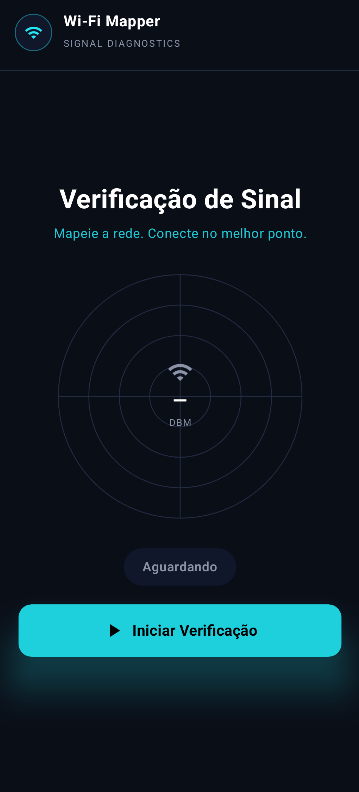
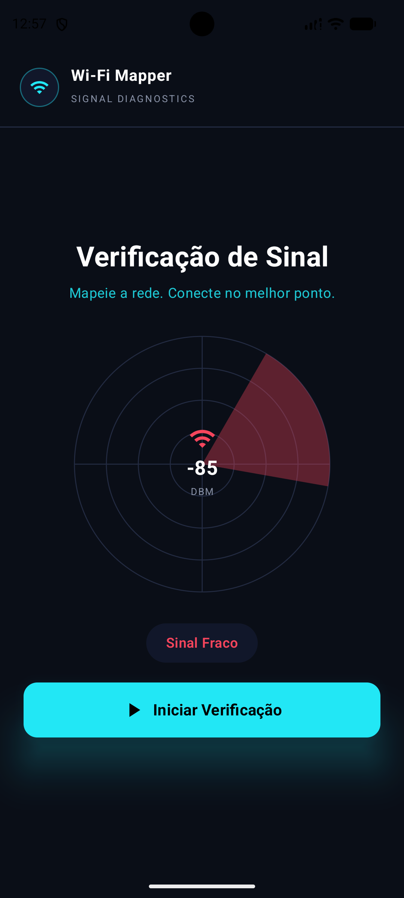

# SPRINT 02 — State & User Interaction

> **Disciplina:** Desenvolvimento de Software Móvel (2026.2)  
> **Equipe:** Team 03  
> **Integrantes:** Célia Hiromi (@hiromilly) e Geovanna Gaspar (@gegwspar)  
> **Ciclo de Desenvolvimento:** `SPEC → BUILD → VALIDATE → EXPLAIN → COMMIT`  
> **Prazo Oficial:** 28/09/2026  

---

## 1. Interação Escolhida

Ao tocar no botão **"Iniciar Verificação"**, o aplicativo simula uma leitura de intensidade de sinal Wi-Fi e atualiza visualmente a interface de forma reativa:
- O valor em **dBm** exibido no centro do radar (`-45 dBm`, `-68 dBm` ou `-85 dBm`);
- O setor de varredura colorido desenhado no radar em `Canvas` (verde, amarelo/laranja ou vermelho);
- A cor do ícone central de Wi-Fi;
- O chip de status logo abaixo do radar muda de **"Aguardando"** para **"Sinal Forte"**, **"Sinal Médio"** ou **"Sinal Fraco"**, acompanhado de sua cor indicativa.

---

## 2. Estado Introduzido

- **Variável de Estado:** `signalStatus`, do tipo `SignalStatus` (enum), gerenciada na Composable via:
  ```kotlin
  var signalStatus by remember { mutableStateOf(SignalStatus.NONE) }
  ```
- **Estado Inicial:** `SignalStatus.NONE` — indica que nenhuma verificação foi realizada ainda.
- **Modelagem do Estado (`SignalStatus`):**
  Cada constante do enum encapsula os dados necessários para a renderização reativa da UI:
  - `label`: texto exibido no chip de status (ex: `"Aguardando"`, `"Sinal Forte"`, `"Sinal Médio"`, `"Sinal Fraco"`);
  - `color`: cor temática associada ao nível de sinal;
  - `dbm`: valor numérico representativo em decibéis-miliwatts (dBm);
  - `sweepAngle`: ângulo de abertura do setor do radar.

---

## 3. Evento que Altera o Estado

O evento de clique do botão **"Iniciar Verificação"** (`onClick`) sorteia aleatoriamente um dos estados ativos (`STRONG`, `MEDIUM` ou `WEAK`) e atribui o novo valor à variável de estado `signalStatus`:

```kotlin
Button(
    onClick = {
        val nextStatuses = listOf(SignalStatus.STRONG, SignalStatus.MEDIUM, SignalStatus.WEAK)
        signalStatus = nextStatuses.random()
    }
) { ... }
```

O fluxo cumpre rigorosamente o ciclo exigido:
```text
Estado Inicial (NONE / Aguardando)
       ↓
Ação do Usuário (Toque no Botão)
       ↓
Atualização do Estado (signalStatus = aleatório)
       ↓
Recomposição Automática da UI (Radar + dBm + Chip)
```

---

## 4. UI que Reage ao Estado

- **Radar Canvas (`RadarView`):** Desenha a malha concêntrica e, quando `signalStatus != SignalStatus.NONE`, renderiza um setor circular estilizado com opacidade translúcida na cor do estado atual.
- **Texto Central do Radar:** Exibe `"—"` no estado inicial ou o valor correspondente (ex: `"-85"`) acompanhado do rótulo `"DBM"`.
- **Ícone de Wi-Fi Central:** Reage mudando sua tonalidade conforme a intensidade do sinal detectada.
- **Chip de Status:** Exibe uma pílula arredondada com o rótulo (`label`) e cor do status atual.

---

## 5. Rastreabilidade com a SPEC-002

A especificação técnica detalhada está documentada em:
- [`docs/specs/SPEC-002.md`](docs/specs/SPEC-002.md)

| Requisito Funcional | Critério de Aceitação | Implementação | Validação |
| :--- | :--- | :--- | :--- |
| **FR-01** (Variável de estado) | **AC-01** | `remember { mutableStateOf(SignalStatus.NONE) }` | Validado via código e recomposição |
| **FR-02** (Estado inicial "Aguardando") | **AC-04** | `SignalStatus.NONE` exibe `"— dBm"` e chip `"Aguardando"` | Validado em `before-interaction.png` |
| **FR-03** (Evento de clique atualiza estado) | **AC-02** | `Button(onClick = { signalStatus = ... })` | Validado na execução |
| **FR-04** (UI reage visivelmente à mudança) | **AC-03** | Canvas do radar, texto dBm, cor e chip reagem ao estado | Validado em `after-interaction.png` |

---

## 6. Regressão e Continuidade da Sprint 01

A funcionalidade da Sprint 01 (identidade da marca **Wi-Fi Mapper**, slogan orientador *"Mapeie a rede. Conecte no melhor ponto."* e botão de ação primária) foi preservada e aprimorada para a nova identidade visual moderna com foco em usabilidade e diagnóstico de sinal.

---

## 7. Evidências de Validação

As evidências foram capturadas e salvas na pasta obrigatória da Sprint:

### Antes da Interação (Estado Inicial: Aguardando)


### Depois da Interação (Estado Atualizado: Sinal Verificado)


---

## 8. Uso de Ferramentas de IA (LLM)

| Item | Resposta da Equipe |
| :--- | :--- |
| **LLM/Ferramenta Utilizada** | Claude e Gemini (Antigravity) |
| **Tarefa Apoiada pela LLM** | Modelagem do estado declarativo com `enum class SignalStatus`, implementação da lógica reativa com `remember`/`mutableStateOf` e estruturação do desenho vetorial do radar com `Canvas`. |
| **Principal Sugestão Recebida** | Encapsular os atributos visuais (cor, dBm e rótulo) diretamente no enum de estado, simplificando o fluxo unidirecional de dados na UI. |
| **O que a Equipe Alterou Manualmente** | Adaptação e refinamento de layout, tipografia, paleta de cores escura, alinhamento dos componentes e testes no emulador Android. |
| **Como o Resultado foi Validado** | Execução e inspeção visual no emulador Android (API 34), validação do ciclo de clique repetido sem crash e conferência das evidências antes/depois. |

---

## 9. Critérios de Aceitação da Sprint 02

- [x] **AC-01** — `SPEC-002.md` existe e está preenchido.
- [x] **AC-02** — Interação com significado para o produto definida.
- [x] **AC-03** — O aplicativo contém pelo menos uma variável de estado (`signalStatus`).
- [x] **AC-04** — Evento do usuário dispara alteração de estado.
- [x] **AC-05** — UI reage visivelmente à mudança de estado.
- [x] **AC-06** — Estados inicial e atualizado comportam-se corretamente.
- [x] **AC-07** — Funcionalidades da Sprint 01 preservadas.
- [x] **AC-08** — Aplicativo compila e executa sem crashes.
- [x] **AC-09** — Evidências antes/depois salvas em `evidence/sprint-02/`.
- [x] **AC-10** — Equipe apta a explicar todo o fluxo de estado.
