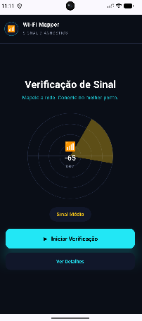
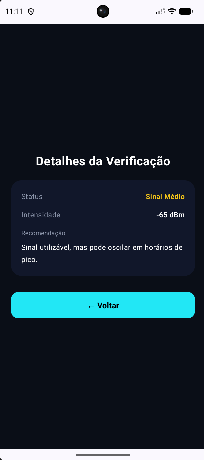
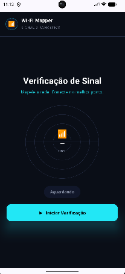

# SPRINT 03 — Navigation & Multiple Screens

> **Disciplina:** Desenvolvimento de Software Móvel (2026.2)  
> **Equipe:** Team 03  
> **Integrantes:** Célia Hiromi (@hiromilly) e Geovanna Gaspar (@gegwspar)  
> **Ciclo de Desenvolvimento:** `SPEC → BUILD → VALIDATE → EXPLAIN → COMMIT`  
> **Prazo Oficial:** 05/10/2026  

---

## 1. Telas Definidas

Nesta Sprint 03, o **Wi-Fi Mapper** evoluiu de um aplicativo de tela única para uma arquitetura com múltiplas telas navegáveis:

- **HomeScreen (Rota `home`):** Tela principal de diagnóstico e verificação de sinal Wi-Fi (consolidada a partir das Sprints 01 e 02). Contém o cabeçalho oficial, o radar vetorial em Canvas com coordenadas e setor iluminado, o chip de status qualitativo, o botão de ação primária **"Iniciar Verificação"** e o botão condicional de navegação **"Ver Detalhes"**.
- **DetailsScreen (Rota `details/{status}`):** Tela secundária focada no detalhamento técnico e orientador do resultado. Exibe o status da conexão, a intensidade numérica precisa em dBm, uma recomendação textual prática de usabilidade e o botão **"← Voltar"** para retornar ao painel principal.

---

## 2. Por que essas Duas Telas Existem

A divisão entre **HomeScreen** e **DetailsScreen** atende diretamente à proposta de valor do **Wi-Fi Mapper**:
- A **HomeScreen** prioriza a agilidade: o usuário precisa apenas abrir o app e tocar em um botão para ter uma resposta visual rápida (radar, cor e dBm) do sinal no cômodo.
- A **DetailsScreen** fornece contexto adicional e orientações práticas de rede (como orientar o usuário se o sinal é adequado para reuniões ou se precisa de repetidor) sem poluir ou sobrecarregar visualmente a tela principal. O usuário acessa essas informações aprofundadas apenas quando desejar, por meio de uma ação intencional.

---

## 3. Rota que Conecta as Telas

A transição entre as telas ocorre por meio da rota parametrizada:
```text
details/{status}
```
Ao tocar em **"Ver Detalhes"**, a aplicação invoca:
```kotlin
navController.navigate("details/${status.name}")
```
O parâmetro `${status.name}` transporta a constante do enum (`STRONG`, `MEDIUM` ou `WEAK`) selecionada no sorteio da tela inicial. No destino, o argumento é lido pelo `NavBackStackEntry` e convertido com segurança via `SignalStatus.fromName(statusParam)`, garantindo que a tela de detalhes renderize exatamente os dados e a cor da verificação realizada.

---

## 4. Onde a Navegação é Disparada

1. **Navegação para Frente (HomeScreen → DetailsScreen):**
   - Disparada no evento `onClick` do botão **"Ver Detalhes"** em `HomeScreen.kt`.
   - O botão é exibido somente após uma medição ativa (`status != SignalStatus.NONE`).
   - O callback é transmitido para o `NavHost` em `MainActivity.kt`, que executa `navController.navigate(...)`.

2. **Navegação de Retorno (DetailsScreen → HomeScreen):**
   - Disparada no evento `onClick` do botão **"← Voltar"** em `DetailsScreen.kt`.
   - O componente raiz executa `navController.popBackStack()`, desempilhando a tela de detalhes.
   - O botão físico ou gesto nativo de voltar do sistema Android também opera de maneira idêntica graças ao gerenciamento automático de pilha do `NavHost`.

---

## 5. Validação do Retorno e Preservação de Estado

O estado da medição de sinal é gerenciado no componente raiz `WifiMapperApp` através de:
```kotlin
var signalStatus by rememberSaveable { mutableStateOf(SignalStatus.NONE) }
```
Dessa forma, ao navegar para a `DetailsScreen` e posteriormente retornar à `HomeScreen` (seja pelo botão "Voltar" ou pelo gesto do sistema), o resultado da medição, a cor do setor do radar e o chip de status continuam exatamente iguais aos de antes da navegação, garantindo uma experiência contínua e sem perda de dados.

---

## 6. Regressão e Continuidade das Sprints 01 e 02

- **Sprint 01:** A identidade visual, o nome do produto (**Wi-Fi Mapper**), o slogan descritivo (*"Mapeie a rede. Conecte no melhor ponto."*) e a tipografia em Material Design 3 foram preservados.
- **Sprint 02:** O gerenciamento reativo de estado, o sorteio entre os níveis de sinal, o radar vetorial desenhado em `Canvas` e o chip informativo continuam plenamente operacionais na `HomeScreen`.
- **Modularização:** O código foi desmembrado de uma única `MainActivity.kt` para arquivos independentes (`SignalStatus.kt`, `HomeScreen.kt`, `DetailsScreen.kt` e `MainActivity.kt`), atendendo diretamente às diretrizes de boas práticas e arquitetura limpa solicitadas pelo professor.

---

## 7. Rastreabilidade com a SPEC-003

A especificação técnica completa encontra-se documentada em:
- [`docs/specs/SPEC-003.md`](docs/specs/SPEC-003.md)

| Requisito Funcional | Critério de Aceitação | Implementação | Validação |
| :--- | :--- | :--- | :--- |
| **FR-01** (Botão "Ver Detalhes" condicional) | **AC-02, AC-07** | `if (status != SignalStatus.NONE)` em `HomeScreen.kt` | Validado visualmente na `HomeScreen` |
| **FR-02** (Navegação com parâmetro de rota) | **AC-03, AC-04** | `navController.navigate("details/${status.name}")` | Validado na transição de tela |
| **FR-03** (Exibição de diagnóstico completo) | **AC-05** | Card com status, dBm e recomendação em `DetailsScreen.kt` | Validado na `DetailsScreen` |
| **FR-04** (Botão de retorno à tela inicial) | **AC-06, AC-07** | `navController.popBackStack()` em `DetailsScreen.kt` | Validado no retorno com estado mantido |

---

## 8. Evidências de Validação

As evidências foram organizadas na pasta oficial da Sprint conforme a estrutura exigida:

### 1. HomeScreen com Verificação Realizada (`screen-a.png`)
Exibição do radar iluminado, valor em dBm, chip de status e o botão **"Ver Detalhes"** habilitado:


### 2. DetailsScreen com Diagnóstico Completo (`screen-b.png`)
Exibição do card detalhado contendo Status, Intensidade, Recomendação textual e o botão **"← Voltar"**:


### 3. Retorno à Tela Inicial com Estado Mantido (`back-preserved.png`)
Retorno após o acionamento do botão "Voltar", confirmando que os dados do radar e do sinal permanecem preservados:


---

## 9. Registro de Uso de Inteligência Artificial (LLM)

Em conformidade com a política de integridade da disciplina:

| Item | Resposta da Equipe |
| :--- | :--- |
| **LLM / Ferramenta Utilizada** | Antigravity AI / Claude & Gemini |
| **Tarefa Apoiada pela LLM** | Auxílio na refatoração e divisão modular dos componentes Compose (`HomeScreen.kt` e `DetailsScreen.kt`), estruturação da rota parametrizada no `NavHost` e alinhamento do template formal da `SPEC-003`. |
| **Principal Sugestão Recebida** | Utilizar passagem de parâmetro via rota (`details/{status}`) associada ao `rememberSaveable` no componente raiz, evitando duplicar o estado da medição entre telas. |
| **O que a Equipe Alterou Manualmente** | Desenvolvimento das composables no Jetpack Compose, ajuste fino do design visual escuro, definição das recomendações amigáveis de texto e testes no emulador Android. |
| **Como o Resultado foi Validado** | Compilação via Gradle (`assembleDebug`), testes interativos de navegação (ida e volta) no emulador Android e inspeção do back stack. |

---

## 10. Critérios de Aceitação da Sprint 03

- [x] **AC-01** — `SPEC-003.md` existe e está devidamente preenchida na pasta `docs/specs/`.
- [x] **AC-02** — Existem pelo menos duas telas com responsabilidades claras (`HomeScreen` e `DetailsScreen`).
- [x] **AC-03** — O Navigation Compose (`NavHost` e `NavController`) foi implementado com sucesso.
- [x] **AC-04** — Ação do usuário no botão "Ver Detalhes" navega para a tela de destino.
- [x] **AC-05** — O conteúdo da tela de detalhes reflete o status obtido na medição inicial.
- [x] **AC-06** — O botão "Voltar" e o gesto do sistema retornam à tela inicial corretamente.
- [x] **AC-07** — Funcionalidades das Sprints 01 e 02 (radar, chip, botões) permanecem operacionais e o estado é preservado.
- [x] **AC-08** — O aplicativo compila e executa sem falhas ou crashes (`BUILD SUCCESSFUL`).
- [x] **AC-09** — Evidências visuais salvas na pasta `evidence/sprint-03/`.
- [x] **AC-10** — A equipe compreende e está apta a explicar todo o grafo e ciclo de navegação.

---

## 11. Informações de Submissão Git

- **Branch da Sprint:** `team-03/sprint-03`
- **Padrão Semântico de Commits:**
  - `docs: define SPEC-003 and navigation requirements`
  - `feat: implement multi-screen navigation with Navigation Compose`
  - `docs: add sprint 03 report and navigation evidence`
- **Título do Pull Request:** `[Sprint 03] Team 03 — Navigation & Multiple Screens`
- **Repositório Base:** `brenofeliix/mobile-development-2026-2` (branch `main`)
- **Repositório de Origem (Fork):** `hiromilly/mobile-development-2026-2` (branch `team-03/sprint-03`)

---

## 12. Checklist de Definição de Pronto (Definition of Done)

- [x] `SPEC-003.md` completa e consistente.
- [x] Pelo menos duas telas navegáveis implementadas.
- [x] Navegação de ida e volta operando com integridade de estado.
- [x] Funcionalidades anteriores (Sprints 01 e 02) preservadas sem regressão.
- [x] Aplicação compilada com sucesso no Gradle.
- [x] Evidências salvas em `projects/team-03/evidence/sprint-03/`.
- [x] Relatório da Sprint completo com documentação do uso de IA.
- [x] Equipe pronta para apresentar e explicar o código ao professor.
