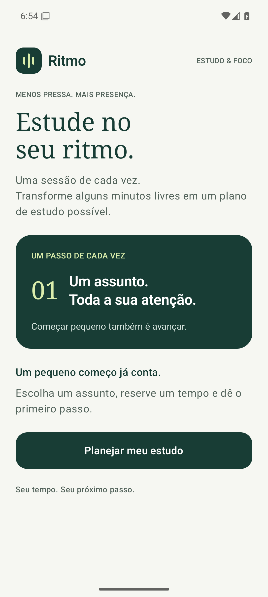

# SPRINT 01 — Product Definition & First Screen

**Equipe 09:** Fernando Henrique Cobianchi e João Victor R. Peres.

## Objetivo e resultado

Definimos o produto Ritmo e implementamos a tela inicial com nome, slogan, descrição, cartão de foco e botão “Planejar meu estudo”. Nesta sprint, a ação do botão ainda não possui comportamento.

## Definição do produto

**Nome:** Ritmo.

**Problema:** Estudantes com tempo limitado podem adiar o estudo por não saberem estruturar uma sessão curta.

**Público:** Estudantes universitários.

**Objetivo:** Ajudar a transformar minutos disponíveis em um plano de estudo.

**Funcionalidades iniciais:** apresentação, escolha de duração e consulta ao plano, introduzidas nas sprints 1, 2 e 3.

## Especificação

[SPEC-001](docs/specs/SPEC-001.md). A seção de rastreabilidade relaciona cada requisito ao código, critério de aceitação e evidência.

## Implementação

`MainActivity` aplica `RitmoTheme` e chama `WelcomeScreen`. A tela utiliza `Scaffold` e seu padding para respeitar as barras do sistema. `Column`, `Row`, `Spacer` e `Modifier` organizam o conteúdo, enquanto `Text` e `Button` apresentam a identidade e a ação principal. A rolagem permite acessar o conteúdo em telas menores.

## Validação

Compilação e execução aprovadas. Foi executado 1 teste instrumentado, sem falhas. [Resultados por critério](evidence/sprint-01/validation.md), [log de compilação e testes](evidence/sprint-01/build-and-tests.txt) e [resultado JUnit](evidence/sprint-01/instrumented-tests.xml).

## Ajustes e limitações

Com apoio do Codex, organizamos a tela com margens, tema e rolagem.

Ação principal sem interação nesta sprint; navegação e estado serão introduzidos nos próximos incrementos.

## Uso de IA

| Item | Resposta |
| --- | --- |
| LLM/tool used | Codex |
| Task supported by the LLM | Especificação, implementação, configuração, testes e documentação |
| Main suggestion received | Separação da Activity, tema e tela inicial em componentes Compose. |
| What the team changed manually | Não houve alterações manuais adicionais; utilizamos o Codex nos ajustes descritos acima. |
| How the result was validated | Gradle, execução no emulador, capturas via ADB e testes instrumentados |

## Entrega

Branch: `team-09/sprint-01`. [Pull Request #20](https://github.com/brenofeliix/mobile-development-2026-2/pull/20), com destino à `main` do repositório da disciplina.

Este incremento inclui o conteúdo das sprints anteriores; a revisão pode seguir a ordem dos PRs.

## Definition of Done

- [x] Especificação e funcionalidade implementadas.
- [x] Compilação e execução verificadas.
- [x] Evidências e resultados registrados.
- [x] Uso de IA documentado.
- [x] Branch publicada e PR enviado.
