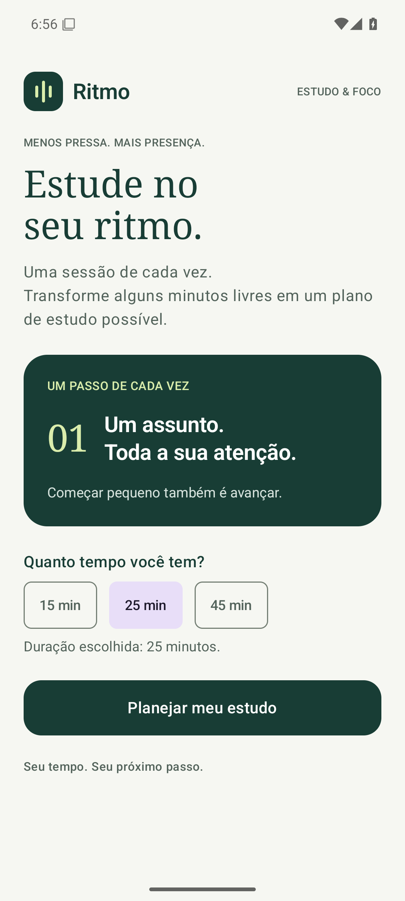
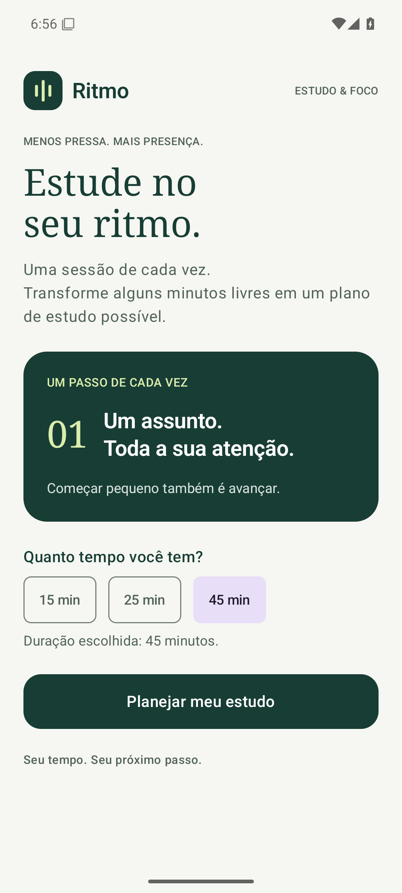

# Validação — Sprint 02

Validação realizada em 28/09/2026, em Pixel 6 virtual com Android 15/API 35 (x86_64). Capturas obtidas pelo ADB.

Comando: `gradlew.bat assembleDebug connectedDebugAndroidTest --console=plain`.
Resultado: **BUILD SUCCESSFUL**, testes instrumentados aprovados. Logs completos em [build-and-tests.txt](build-and-tests.txt); resultados JUnit em [instrumented-tests.xml](instrumented-tests.xml).

| Critério da SPEC | Resultado | Como foi verificado |
| --- | --- | --- |
| AC-01 | PASS | Estado inicial 25, teste de seleção e resumo. |
| AC-02 | PASS | 15 e 45: seleção exclusiva confirmada pelo teste. |
| AC-03 | PASS | Resumo compara o número esperado após cada escolha. |
| AC-04 | PASS | Três ciclos 15 → 45 → 25 e elementos anteriores preservados. |

## Evidências

