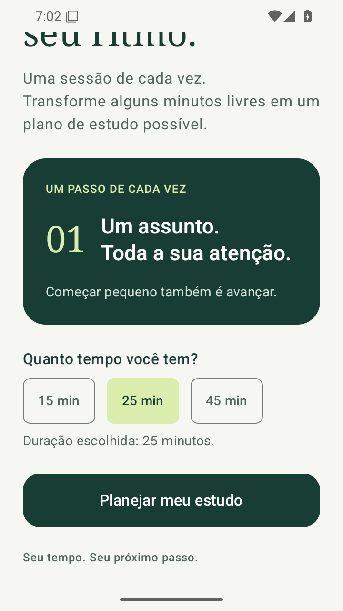
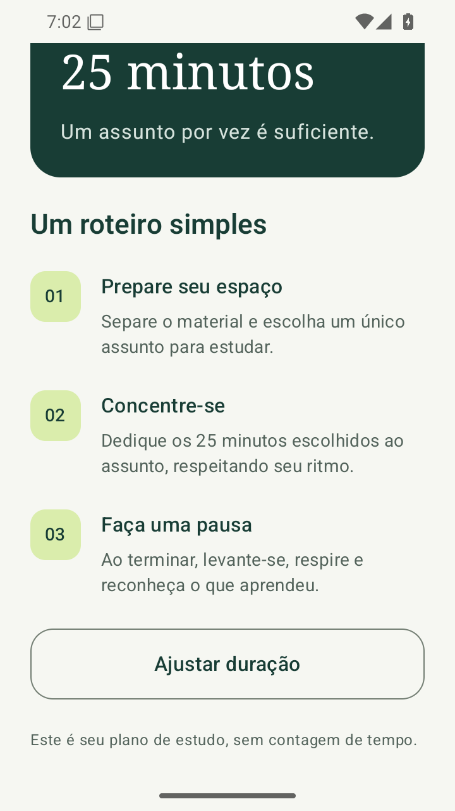
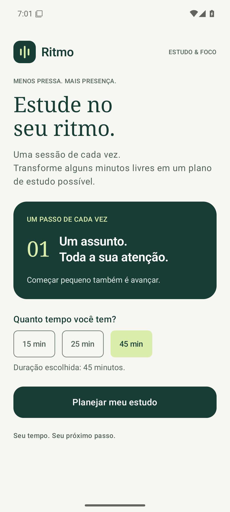
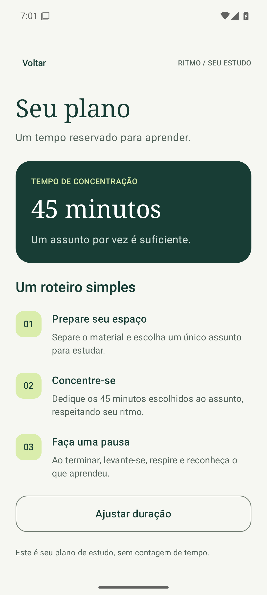

# Validação — Sprint 03

Validação realizada em 28/09/2026, em Pixel 6 virtual com Android 15/API 35 (x86_64). Capturas obtidas pelo ADB.

Comando: `gradlew.bat assembleDebug connectedDebugAndroidTest lintDebug --console=plain`.
Resultado: **BUILD SUCCESSFUL**, testes instrumentados aprovados. Logs completos em [build-and-tests.txt](build-and-tests.txt); resultados JUnit em [instrumented-tests.xml](instrumented-tests.xml).

| Critério da SPEC | Resultado | Como foi verificado |
| --- | --- | --- |
| AC-01 | PASS | Abertura na tela inicio. |
| AC-02 | PASS | Ação principal mostra Seu plano. |
| AC-03 | PASS | Teste percorre 15, 25 e 45 e verifica as orientações. |
| AC-04 | PASS | Retornos por barra, ação Ajustar duração e Android; saída na raiz validada com ADB. |
| AC-05 | PASS | Seleção preservada; repetição e avanço rápido verificados. |

## Verificações adicionais

- `lintDebug`: aprovado, **0 erros e 9 avisos**. Oito avisos informam versões mais recentes de dependências; um sugere regras de backup do Android 12+. Não há dados persistidos pelo aplicativo nesta entrega. Há também uma recomendação informativa de `mutableIntStateOf`; foi mantido `mutableStateOf` para explicitar o conceito estudado.
- O atributo `windowLightNavigationBar` foi colocado em `values-v27/themes.xml`, evitando exigir API 27 no tema base (minSdk 24).
- O teste de retorno usa Espresso 3.6.1, declarado explicitamente nas dependências de androidTest.
- O Voltar do Android na raiz retornou ao launcher, conforme [root-back.txt](root-back.txt).
- Tela reduzida para 720×1280 px, densidade 320 (360×640 dp): rolagem permitiu alcançar a ação principal e Ajustar duração. As capturas abaixo mostram a posição após rolar, por isso o conteúdo anterior fica fora do viewport. Resolução e densidade foram restauradas após a verificação.

## Fluxo na resolução padrão

